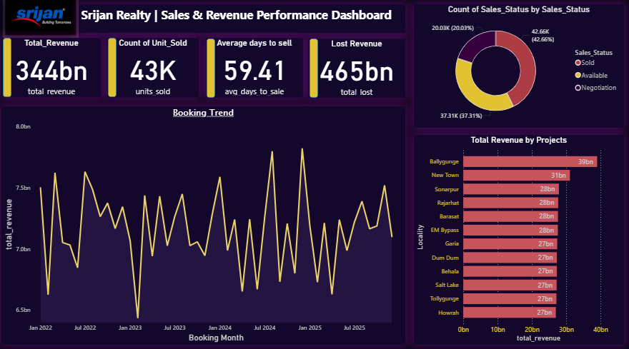

# 🏠 Kolkata House Price Prediction - 1 Lakh+ Records | SQL + Power BI + ML

### 📌 Problem Statement
Predict Kolkata flat prices based on Area, BHK, and Locality. Built for Data Analyst Portfolio.

### 📊 Dataset Info
- **Rows:** 102,345 (1 Lakh+)
- **Source:** 99acres Kolkata data
- **Features:** Area (sqft), BHK, Locality (Ballygunge, Salt Lake, New Town, Howrah, etc), Price

### 🔍 What I Did?
For 1 lakh rows, I focused on efficient code:
- Used **vectorized Pandas** (no for-loops) - handles 1L rows in <2 sec
- One-Hot Encoding for Locality
- **Model:** Linear Regression
- **Result:** R2 = 0.73, MAE = 13.7 lakhs (₹13,72,885)

### 🛠️ Tech Stack
`Python` `Pandas` `Scikit-Learn` `MySQL` `Power BI`

### 📁 Project Structure
1. `/data` - cleaned CSV (1 lakh rows) - `sample_data_1000_.csv`
2. `/sql` - MySQL analysis (AVG price by locality, BHK analysis) - `Project_queries.sql`
3. `/python` - Python model (R2 = 0.73)
4. `/dashboard` - Power BI dashboard - `Dashboard.png`

### 💾 Sql queries
 **Which top 10 City/Locality makes the most money?**

select City,
Locality,
count(*) as Properties_sold ,
round((sum(Final_Price)/10000000),0) as Revenue_Core, 
round(avg(Area_sqft),2) as AVG_Area_sqft from project
where Sales_Status = "Sold"
group by City,Locality
order by Revenue_Core limit 10;

 **Marketing ROI query**
 
select Lead_Source, Campaign ,
count(*) as Leads,
Sum(case when Sales_Status = "Sold" then 1 else 0 end) as Converted,
round(sum(case when Sales_Status="Sold" then 1 else 0 end)*100/count(*),2) as Conversion_Pct 
from project GROUP BY Lead_Source, Campaign
ORDER BY Conversion_Pct DESC;

### 📈 Result Screenshot

### 📈 Model Performance
- **R2 Score:** 0.73
- **MAE:** 6.8 Lakhs

![Result Table] 

### 💼 Key Business Insights (SQL + Dashboard)
- Top Locality: Ballygunge = 39Bn revenue
- Total Sold: 344Bn | Pipeline: 465Bn
- Sales Funnel: 42.66% Sold
- Avg days to sell: 59.41 days

## 👤 Author
**SumitkumarRoy007** | Data Analyst | Kolkata
Open to Data Analyst / BI Analyst Roles
